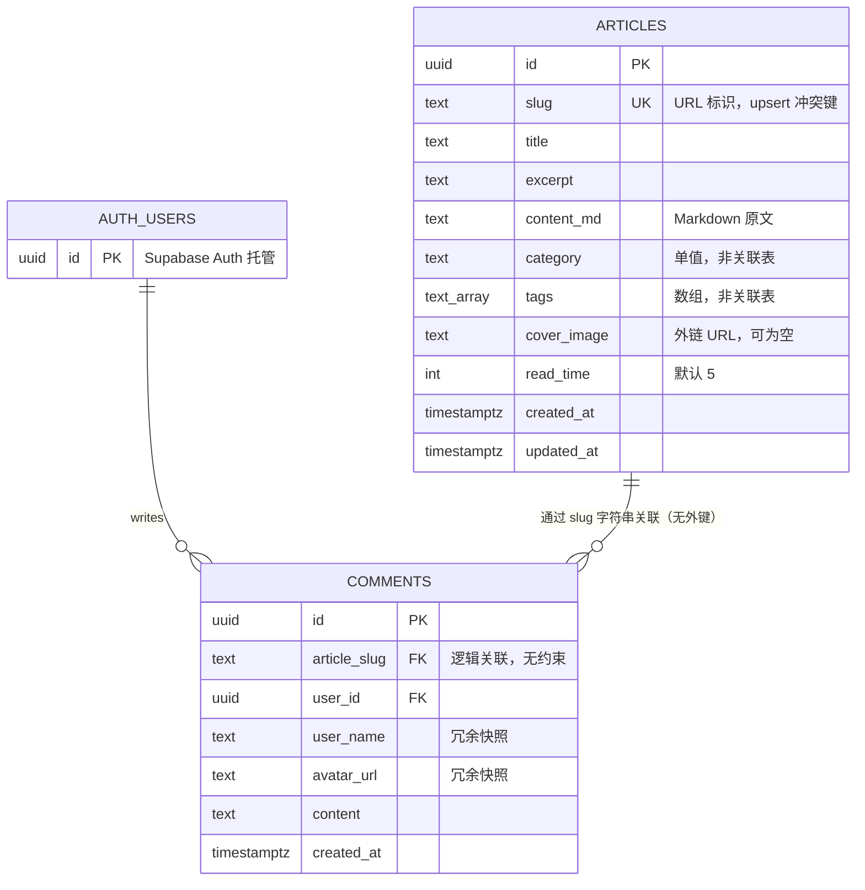
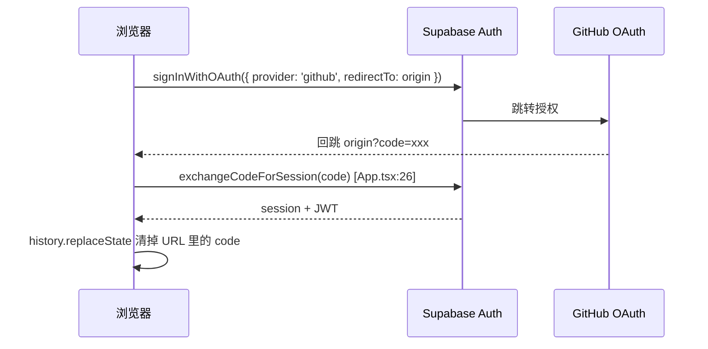

# 技术架构文档

> **文档状态**：2026-09-24 重写。
>
> 上一版（Trae 生成）与代码严重不符，已作废。它描述了 `users` 表、`articles.author_id`、`tags` / `article_tags` 关联表、`published` 字段、`GET /api/articles` REST 层——**这些在代码里一个都不存在**。把规划当现状写，是比没有文档更坏的事。
>
> 本文严格区分两种状态，全文用标记区分：
>
> - **【已实现】** — 代码里能跑通，有文件路径可查
> - **【规划】** — 尚未实现，属于待办
>
> 未标记的均默认为【已实现】。

---

## 0. 一句话现状

一个**前端直连 Supabase 的 SPA 博客**：浏览器拿 anon key 直接读写 Postgres，安全性完全依赖 RLS 策略，没有中间层服务。

```
访客/管理员浏览器
      │  anon key + JWT
      ▼
  Supabase（Postgres + Auth + RLS）
      │
      │  (另外) 浏览器直连 GitHub REST API 拉仓库列表
      ▼
  api.github.com
```

---

## 1. 真实技术栈

| 层 | 选型 | 说明 |
|---|---|---|
| 构建 | Vite 4 + TypeScript 5.0 | `build.sourcemap: 'hidden'` |
| 框架 | React 18 | 无 SSR，纯 CSR |
| 路由 | react-router-dom 6 | 4 条路由，见 §5 |
| 样式 | Tailwind CSS 3 + CSS Variables | 双主题，见 §3.4 |
| 状态 | zustand 5 | 仅 `authStore` 一个 store |
| 动效 | framer-motion 11 + GSAP 3 | GSAP 实际未在页面中使用【待确认】 |
| 轮播 | swiper 11 | `HeroCarousel` |
| Markdown | react-markdown 9 + rehype-sanitize 6 | 渲染侧 |
| Markdown 编辑 | @uiw/react-md-editor 4 | 后台侧 |
| 代码高亮 | prism-react-renderer + react-syntax-highlighter | **两个都装了，功能重叠** |
| 图标 | lucide-react | |
| 后端 | Supabase（Postgres + Auth + RLS） | 无 Storage、无 Edge Function |
| 部署 | Vercel | `vercel.json` 全量 rewrite 到 `index.html` |

> **依赖卫生问题**：`prism-react-renderer` 与 `react-syntax-highlighter` 职责完全重叠，`clsx` 与 `tailwind-merge` 也都装了（`lib/utils.ts` 只用了其中一个）。属于脚手架残留，建议清掉一个。

---

## 2. 目录结构

```
src/
  App.tsx                    启动、鉴权初始化、路由表
  main.tsx                   React 挂载
  index.css                  CSS 变量（双主题配色）
  auth/githubAuth.ts         GitHub OAuth：登录 / 换取 session / 登出
  store/authStore.ts         zustand：user / isAdmin
  lib/supabase.ts            Supabase 客户端（pkce 流）
  lib/utils.ts               cn() 类名合并
  hooks/useTheme.ts          主题切换 + localStorage
  components/
    Header.tsx               顶栏：主题切换、登录态、Admin 徽标
    SplashScreen.tsx         首访开屏动画
    HeroCarousel.tsx         首页轮播
    Empty.tsx                空状态
  pages/
    Home.tsx                 首页：GitHub 项目 + 文章列表
    ArticleDetail.tsx        文章详情 + 评论
    AdminArticleEditor.tsx   后台 Markdown 编辑器
    Projects.tsx             ⚠️ 死代码，见 §7
  utils/
    articlesApi.ts           文章 CRUD（直连 Supabase）
    mockData.ts              ⚠️ mock 数据，仍在被引用，见 §7
supabase/migrations/         SQL 迁移（01–05）
```

---

## 3. 数据模型

### 3.1 ER 图



### 3.2 表结构（来自 migrations，与上述一致）

`articles` — 见 `supabase/migrations/02_init_articles.sql`

`comments` — 见 `supabase/migrations/01_init_comments.sql`

### 3.3 与 PRD 的差距

| PRD 要求 | 实际 | 状态 |
|---|---|---|
| 分类 | `category text` 单值 | 够用 |
| 标签关联表 | `tags text[]` 数组 | **够用**，无需关联表。靠 `tags @> array['x']` 就能查 |
| `published` 草稿状态 | 无此字段 | **缺失** |
| `published_at` 定时发布 | 无此字段 | **缺失** |
| 嵌套评论 | 无 `parent_id` | **缺失** |
| 评论关联文章 | `article_slug` 字符串，**无外键** | 改 slug 会孤儿化评论 |
| 浏览量统计 | 无 | **缺失** |

> **`tags text[]` 不用改成关联表**。个人博客的标签量级在几十个，数组 + GIN 索引完全够，关联表是过早优化。
>
> **`article_slug` 无外键是真问题**。文章改 slug 后旧评论全部失联，且数据库不会报错。修法二选一：加 `article_id uuid references articles(id) on delete cascade`，或明确约定 slug 永不修改。

### 3.4 双主题实现

`index.css` 用 CSS 变量定义两套配色，`tailwind.config.js` 把 `--background` / `--primary` 等映射为 Tailwind 色板：

- `:root` → 肉色/暖色系（`--background: 34 50% 95%`，Peach 主色）
- `.dark` → 深色系（`--background: 0 0% 4%`，蓝色主色）

`useTheme.ts` 在 `documentElement` 上切 `dark` class，存 `localStorage`。

> ⚠️ **两处不一致**：
> 1. `useTheme.ts` 的 `Theme` 类型是 `'dark' | 'light'`，与 PRD 的 `'nude'` 命名不符，且它给非暗色时加 `light` class——但 `index.css` 里**没有 `.light` 规则**，靠的是 `:root` 兜底。能跑，但语义混乱。
> 2. `Projects.tsx` 大量使用 `bg-skin-base` / `text-skin-muted` 等类名，而 `tailwind.config.js` 里**根本没有 `skin` 这个色板**。这些类全部无效。

---

## 4. 鉴权与授权

### 4.1 身份流



关键实现：`src/lib/supabase.ts` 用 `flowType: 'pkce'`；`App.tsx` 在任意 URL 上检测 `?code=` 并换取 session。**没有独立的 `/auth/callback` 路由**——回调就落在首页，靠 `exchangeCodeForSessionFromUrl` 处理。

### 4.2 管理员判定（现在有两套，都不安全）

**后端**（真正的闸门）— `public.is_admin()`：

```sql
select coalesce(
  (auth.jwt() -> 'user_metadata' ->> 'user_name') = 'guoshaoran'
  or (auth.jwt() -> 'user_metadata' ->> 'preferred_username') = 'guoshaoran',
  false
);
```

**前端**（仅 UX）— `authStore.ts`：同样规则，用于隐藏编辑入口、显示 Admin 徽标。

### 4.3 RLS 策略现状

| 表 | 操作 | 策略 |
|---|---|---|
| `articles` | SELECT | `true` — 全公开 |
| `articles` | INSERT / UPDATE / DELETE | `public.is_admin()` |
| `comments` | SELECT | `true` — 全公开 |
| `comments` | INSERT | `auth.uid() = user_id` |
| `comments` | UPDATE / DELETE | `auth.uid() = user_id` |

> 注意：**管理员无法删除他人评论**。PRD 要求管理员有"删除评论"权限，当前策略做不到。

### 4.4 🔴 P0：`is_admin()` 可被任意登录用户绕过

`auth.jwt() -> 'user_metadata'` 读的是 `raw_user_meta_data`，而**用户自己可以修改它**：

```js
// 任何登录用户，一行拿下管理员权限
await supabase.auth.updateUser({ data: { user_name: 'guoshaoran' } })
// JWT 刷新后 is_admin() 返回 true → 可增删改任意文章
```

前端 `authStore` 的 `isAdmin` 也随之变 true，后台入口也会打开。

**修法**（用 `app_metadata`，只有 service_role 能写）：

```sql
create or replace function public.is_admin()
returns boolean
language sql
stable
security definer
set search_path = ''
as $$
  select coalesce(
    (auth.jwt() -> 'app_metadata' ->> 'is_admin')::boolean,
    false
  );
$$;
```

然后给管理员账号设置 `app_metadata`：`{ "is_admin": true }`（Dashboard → Authentication → Users，或用 service_role key 调 Admin API）。**顺带**给该函数加 `security definer` 和固定的 `search_path`，避免被 schema 劫持。

---

## 5. 路由表

| 路由 | 组件 | 权限 | 状态 |
|---|---|---|---|
| `/` | `Home` | 公开 | ✅ |
| `/blog/:slug` | `ArticleDetail` | 公开 | ✅ |
| `/admin/articles/new` | `AdminArticleEditor` | 仅管理员 | ✅（前端判权 + RLS） |
| `/admin/articles/:slug/edit` | `AdminArticleEditor` | 仅管理员 | ✅ |
| `/projects` | `Projects` | 公开 | ❌ **有组件无路由** |
| `/auth/callback` | — | — | ❌ 不需要，已内联处理 |
| `/tags/:tag` | — | 公开 | 📋 规划 |
| `/archive` | — | 公开 | 📋 规划 |
| `/about` | — | 公开 | 📋 规划 |

> 后台路由**没有路由守卫**。非管理员直接访问 `/admin/articles/new` 会看到"需要管理员权限"占位（`AdminArticleEditor.tsx:97`），不是因为路由拦截，而是组件内部判权。能接受，但真正的防线始终是 RLS。**在 §4.4 修好之前，这道防线是漏的。**

---

## 6. 数据访问层

**没有 REST / GraphQL 中间层**。前端通过 `src/utils/articlesApi.ts` 直接调 Supabase SDK：

| 函数 | 行为 |
|---|---|
| `listArticles()` | `select *` 全表，按 `created_at` 倒序，**无分页** |
| `getArticleBySlug(slug)` | 单条查询 |
| `upsertArticle(input)` | 按 `slug` 冲突键 upsert + 自动写 `updated_at` |

**错误处理很粗**：全部 `if (error || !data) return [] / null`，错误被静默吞掉。写文章失败了，用户只会看到"没保存"，不知道原因。

**评论**没有独立模块，读写逻辑内联在 `ArticleDetail.tsx`（`fetchComments` / `submitComment` / `deleteComment`）。`user_name` 和 `avatar_url` 在插入时从 JWT 快照写入——**用户在 GitHub 改名后，历史评论会保留旧名字**。这是有意的冗余换查询简单，但要清楚这个取舍。

**GitHub 项目数据是浏览器直连 `api.github.com` 拉的**（`Home.tsx:52`，`Projects.tsx:22`）：

- `Home.tsx` 尝试用 `session.provider_token` 提权，但 **Supabase 的 `provider_token` 只在登录当次有效，刷新页面后为 null**
- 未登录 / token 失效 → 60 次/小时的匿名限流
- 撞到 403 就回退到 `FALLBACK_PROJECTS` 硬编码常量（`Home.tsx:18`）

> 这是当前实现里最脆弱的一环：仓库列表随时可能显示三个月前的硬编码快照。**正确做法**是把仓库数据在构建时或服务端用带 token 的请求抓一次存进 Supabase，前端只读自己的表。

---

## 7. 技术债清单

按优先级排序，前三项建议优先处理。

| # | 问题 | 证据 | 优先级 |
|---|---|---|---|
| 1 | `is_admin()` 提权漏洞 | `03_update_is_admin.sql` | 🔴 P0 |
| 2 | 生产构建注入 Trae 推广角标 | `vite.config.ts:24` `prodOnly: true` | 🔴 P0 |
| 3 | `Projects.tsx` 双重死代码：无路由 + `skin` 色板不存在 | `App.tsx` 无 `/projects`；`tailwind.config.js` 无 `skin` | 🟠 P1 |
| 4 | `ArticleDetail.tsx` 仍 import `mockData` 做兜底 | `ArticleDetail.tsx:7` | 🟠 P1 |
| 5 | 迁移 04 是坏 SQL，已被 05 重写，应删除 | `04_update_article_style.sql` 单引号字符串内含 `'JavaScript'`，必然报错 | 🟠 P1 |
| 6 | 文章列表无分页，`select *` 全表 | `articlesApi.ts:15` | 🟠 P1 |
| 7 | 无 SEO：`index.html` 零 meta，纯 CSR | `index.html` 无 description / og 标签 | 🟠 P1 |
| 8 | `build.sourcemap: 'hidden'` 生产仍产出 sourcemap | `vite.config.ts:14`，Vercel 会暴露源码 | 🟡 P2 |
| 9 | 评论无 `parent_id`，PRD 要的嵌套回复没做 | `01_init_comments.sql` | 🟡 P2 |
| 10 | 管理员不能删他人评论 | RLS 策略仅 `auth.uid() = user_id` | 🟡 P2 |
| 11 | 无 `published` / `published_at`，草稿和定时发布做不了 | `articles` 表无该字段 | 🟡 P2 |
| 12 | 评论靠 `article_slug` 关联，无外键，改 slug 即孤儿 | `01_init_comments.sql` | 🟡 P2 |
| 13 | `useTheme` 类型 `'light'` 与 PRD 的 `nude` 不符，且无 `.light` 规则 | `useTheme.ts:3` / `index.css` | 🟢 P3 |
| 14 | 重复依赖：两个语法高亮库、`clsx` + `tailwind-merge` | `package.json` | 🟢 P3 |
| 15 | `README.md` 仍是 Vite 模板原文 | `README.md` | 🟢 P3 |
| 16 | `babel-plugin-react-dev-locator` 进了生产构建 | `vite.config.ts:19` | 🟢 P3 |
| 17 | `canvas-confetti` 在架构文档里，实际未安装 | 文档 vs `package.json` | 🟢 P3 |

---

## 8. 后端选型：为什么留在 Supabase

**结论：留在 Supabase，不自建后端。**

| 维度 | Supabase | 自建后端 |
|---|---|---|
| Postgres 能力 | 原生，无抽象损耗 | 等价 |
| 鉴权 | GitHub OAuth 已跑通 | 需自行实现 OAuth + session 刷新，约 1–2 天 |
| 授权 | RLS 数据库层强制 | 需自行实现中间件，且容易漏 |
| 运维 | 零（但有暂停风险，见下） | 服务器、证书、备份、监控 |
| 成本 | 免费（个人博客量级足够） | 域名外的服务器月费 |
| 供应商锁定 | `auth.jwt()`、RLS 语法 | 无 |

自建后端对个人博客**没有收益**：博客的瓶颈是内容产出，不是后端能力。唯一值得自建的理由是"练后端"本身即目标——那属于另一个项目，不该寄生在博客上。

### 必须知晓的两个风险

**① 免费项目会因不活动被暂停。** 这是"Supabase 做博客"唯一的硬伤，也是运维问题不是架构问题。社区因此有专门的保活工具（[supawake](https://www.npmjs.com/package/supawake)、[supabase-keep-alive](https://github.com/marc-awad/supabase-keep-alive)）。三选一：

- 升 Pro（$25/月）—— 最省心
- 挂一个定时任务定期 ping（GitHub Actions / Vercel Cron）
- 接受：自己记得定期登一次

**② 中国大陆访问 `*.supabase.co` 不稳定，且无免费解。** 若读者主要在国内，需要考虑自有域名 + CDN 前置，或迁移到国内可访问的 Postgres 托管。**选型前先确认读者分布。**

---

## 9. 部署与运维

**平台**：Vercel。`vercel.json` 只有一条 SPA rewrite（所有路径回落到 `index.html`）。

**环境变量**（`.env.example`，仅两个）：

```
VITE_SUPABASE_URL=
VITE_SUPABASE_ANON_KEY=
```

> `VITE_` 前缀意味着**这两个值会被打进前端产物**，这是设计如此——anon key 本就是公开的，安全性依赖 RLS。**绝不能**把 `service_role` key 放进任何 `VITE_` 变量。

**本地开发**：`npm run dev` → `scripts/kill-port.mjs` 先释放 5175 端口，再 `vite --port 5175 --strictPort`。

**数据库变更流程**：`supabase/migrations/` 下按序号追加 SQL，手动 apply。**没有自动化迁移工具链**，也没有回滚脚本。规模小的时候够用，但 §7 第 5 条（坏的 04 已被 05 覆盖）说明这个流程已经出过一次错。

---

## 10. 目标架构与演进路线

### 10.1 三条路线

| 路线 | 做法 | 收益 | 代价 |
|---|---|---|---|
| **A. 现状加料** | 保持 Vite SPA + Supabase | 1–2 天可发布 | SEO 上限锁死，分享无预览卡 |
| **B. 迁 Next.js + Supabase** ⭐ | 4 个页面搬到 App Router，数据库不动 | SSR/SSG、OG、RSS、sitemap；Supabase 完全兼容 | 重写路由层（页面少，不难） |
| **C. 自研后端** | Node/Go + Postgres 替换 Supabase | 练后端 | 见 §8，对博客无收益 |

### 10.2 建议

**推荐 B**。判断依据：PRD 写明目标是"提升个人技术影响力"，而这条目标的实现路径 90% 是"内容被找到"。当前纯 CSR 架构恰好堵死了这条路——`index.html` 里没有 description，社交平台抓不到 OG，搜索引擎拿到的是空 div。

**如果"这周就要能发文章"更紧急**，先走 A，把 §7 的 P0/P1 修完再迁——迁移前修，比迁移后修便宜。

### 10.3 功能规划分层

**必做**（缺了不像博客）
- 修 §7 的 P0/P1
- 标签页 / 分类页 / 归档页
- SEO meta + RSS + sitemap
- 文章 TOC + 代码块复制 + 阅读进度
- 列表分页

**加分**（有辨识度，成本可控）
- 全文搜索：Postgres `tsvector` + GIN 索引即可，**不要上 Meilisearch**
- 草稿 / 定时发布：加 `status` + `published_at`
- 浏览量：`articles.views` 一列 + RPC 自增，**不要上 GA**
- 嵌套评论：`comments.parent_id` 自引用
- 图片上传：Supabase Storage（现在封面只能贴外链）
- 跟随系统主题

**明确不做**
- 自研 Markdown 编辑器（`@uiw/react-md-editor` 已在）
- 微服务 / 会员 / 付费
- 标签关联表（数组够用）

### 10.4 被低估的一环：写作闭环

**博客的瓶颈从来不是前端，是"写"的成本。**

当前唯一的写作入口是浏览器里的 Markdown 编辑器。真正能支撑长期产出的是"本地写 `.md` → 一条命令同步"，例如 `scripts/publish.mjs`：读 `content/*.md`（front-matter 存 slug/title/tags），批量 upsert 进 Supabase。

这个投入产出比高于任何前端动效，且它能把 AI 辅助写作变成流水线。

---

## 11. 安全清单

- [ ] 🔴 修复 `is_admin()` 提权（§4.4）
- [ ] 🔴 确认 `service_role` key 未出现在任何 `VITE_` 变量或前端代码中
- [ ] 🟡 正文渲染补上 `rehype-sanitize`。**已核实**：编辑器预览配了（`AdminArticleEditor.tsx:206`、`ArticleDetail.tsx:249`），但正文的 `ReactMarkdown`（`ArticleDetail.tsx:257`）**没配**。当前不构成高危——`react-markdown` 默认转义原始 HTML，只要不引入 `rehype-raw` 就注入不了 `<script>`；且内容作者本就是受信的管理员。属"两处不一致、防线靠默认值兜底"，建议补齐而非依赖默认行为
- [ ] 🟠 移除生产 sourcemap（`vite.config.ts`）
- [ ] 🟡 评论内容加长度上限与频率限制（当前无任何约束，可被刷）
- [ ] 🟡 确认 RLS 对 `anon` 角色确实生效（RLS 开启 + 策略存在，但未见过针对 anon 的显式拒绝测试）
- [ ] 🟢 环境变量：本地 `.env` 已在 `.gitignore` 中 ✅

---

## 12. SEO / 性能清单

**SEO（当前全部缺失）**
- [ ] `index.html` 加 `<meta name="description">`
- [ ] OG / Twitter Card 标签（分享预览卡）
- [ ] 每篇文章的动态 `<title>` 与 description
- [ ] `sitemap.xml` + `robots.txt`
- [ ] RSS / Atom feed
- [ ] 结构化数据（JSON-LD `BlogPosting`）

> 纯 CSR 下以上大部分只能做到"静态兜底"——真正的解法是 §10.1 的路线 B。

**性能**
- [ ] 路由级代码分割（`React.lazy`）—— 当前单包加载
- [ ] 语法高亮按需加载 + 移除重复的高亮库
- [ ] 封面图：Supabase Storage + 尺寸变体（现为外链，无法控制）
- [ ] 文章列表分页，避免全表加载
- [ ] 检查 `SplashScreen` 对 LCP 的影响（首访强制动画会推迟首屏内容）

---

## 附录：本地启动

```bash
cp .env.example .env      # 填入 Supabase URL 与 anon key
npm install
npm run dev               # http://127.0.0.1:5175
npm run check             # tsc --noEmit
npm run lint
npm run build             # tsc --noEmit && vite build
```

数据库需在 Supabase 控制台按 01 → 05 顺序执行迁移（**跳过已损坏的 04**）。
