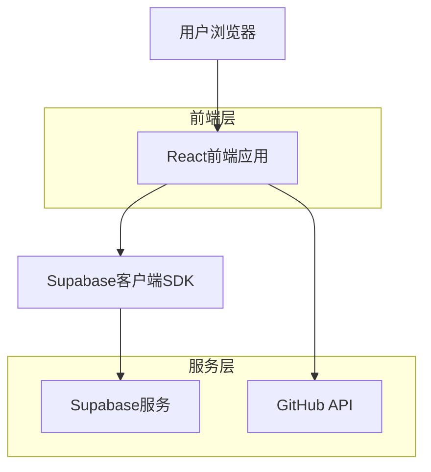
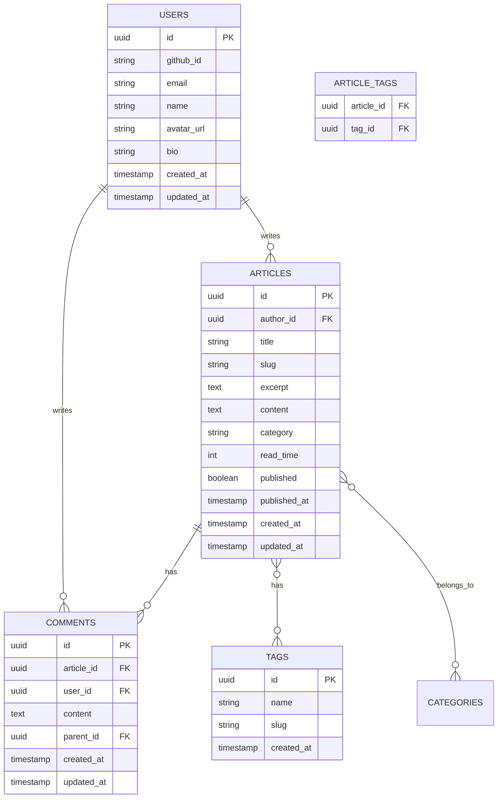

## 1. 架构设计



## 2. 技术描述

- **前端**: React@18 + TypeScript@5 + Tailwind CSS@3 + Vite
- **初始化工具**: vite-init
- **后端**: Supabase (PostgreSQL数据库 + 身份验证 + 文件存储)
- **核心依赖**: 
  - @supabase/supabase-js (Supabase 客户端)
  - react-router-dom@6 (路由管理)
  - gsap (复杂交互动画)
  - swiper (响应式轮播图)
  - framer-motion (UI 动效)
  - zustand (状态管理)
  - lucide-react (图标库)
  - react-markdown (Markdown 渲染)
  - react-syntax-highlighter (代码高亮)
  - canvas-confetti (庆祝动效)

## 3. 核心组件设计

### 3.1 SplashScreen (Canvas 开屏)
- **技术**: 原生 Canvas API + GSAP
- **效果**: 粒子流动或黑客帝国数字雨效果
- **逻辑**: 检测 SessionStorage，仅首次访问展示

### 3.2 ThemeProvider (双主题切换)
- **方案**: Tailwind CSS `class` 模式
- **状态**: `dark` | `nude` (肉色系)
- **实现**: 使用 CSS Variables 定义背景色、文字色、强调色

### 3.3 AuthManager (权限控制)
- **角色**: `Admin` (GitHub ID: guoshaoran) / `Guest`
- **存储**: Supabase Auth + Zustand Store
- **鉴权**: 检查登录用户的 GitHub Username 是否匹配管理员名单

### 3.4 GitHubSync (项目同步)
- **API**: `https://api.github.com/users/guoshaoran/repos`
- **处理**: 过滤 Fork 仓库，按 Star 数排序

## 4. 路由定义

| 路由 | 用途 | 访问权限 |
|------|------|----------|
| / | 首页 (轮播 + 简介) | 公开 |
| /projects | 项目中心 (GitHub Repos) | 公开 |
| /blog/:slug | 文章详情 (带评论区) | 公开 |
| /admin/edit/:id? | 文章编辑器 (富文本) | 仅管理员 |
| /auth/callback | OAuth 回调处理 | 公开 |

## 5. API定义

### 4.1 文章相关API

**获取文章列表**
```
GET /api/articles
```

请求参数：
| 参数名 | 参数类型 | 是否必需 | 描述 |
|--------|----------|----------|------|
| page | number | false | 页码，默认1 |
| limit | number | false | 每页数量，默认10 |
| category | string | false | 分类筛选 |
| tag | string | false | 标签筛选 |
| search | string | false | 搜索关键词 |

响应示例：
```json
{
  "articles": [
    {
      "id": "uuid",
      "title": "文章标题",
      "slug": "article-slug",
      "excerpt": "文章摘要",
      "content": "文章内容",
      "category": "技术",
      "tags": ["React", "TypeScript"],
      "read_time": 5,
      "created_at": "2024-01-01T00:00:00Z",
      "updated_at": "2024-01-01T00:00:00Z"
    }
  ],
  "total": 100,
  "page": 1,
  "total_pages": 10
}
```

**创建文章**
```
POST /api/articles
```

请求体：
```json
{
  "title": "新文章标题",
  "content": "# 标题\n文章内容",
  "category": "技术",
  "tags": ["React"],
  "published": true
}
```

### 4.2 GitHub集成API

**获取用户仓库**
```
GET /api/github/repos
```

响应示例：
```json
{
  "repos": [
    {
      "id": 123456,
      "name": "awesome-project",
      "description": "项目描述",
      "html_url": "https://github.com/user/repo",
      "stargazers_count": 100,
      "forks_count": 20,
      "language": "TypeScript",
      "updated_at": "2024-01-01T00:00:00Z"
    }
  ]
}
```

## 6. 数据模型

### 6.1 数据模型定义



### 6.2 数据定义语言

**用户表 (users)**
```sql
-- 创建用户表
CREATE TABLE users (
  id UUID PRIMARY KEY DEFAULT gen_random_uuid(),
  github_id VARCHAR(50) UNIQUE NOT NULL,
  email VARCHAR(255) UNIQUE NOT NULL,
  name VARCHAR(100) NOT NULL,
  avatar_url TEXT,
  bio TEXT,
  created_at TIMESTAMP WITH TIME ZONE DEFAULT NOW(),
  updated_at TIMESTAMP WITH TIME ZONE DEFAULT NOW()
);

-- 创建索引
CREATE INDEX idx_users_github_id ON users(github_id);
CREATE INDEX idx_users_email ON users(email);
```

**文章表 (articles)**
```sql
-- 创建文章表
CREATE TABLE articles (
  id UUID PRIMARY KEY DEFAULT gen_random_uuid(),
  author_id UUID REFERENCES users(id) ON DELETE CASCADE,
  title VARCHAR(255) NOT NULL,
  slug VARCHAR(255) UNIQUE NOT NULL,
  excerpt TEXT,
  content TEXT NOT NULL,
  category VARCHAR(50),
  read_time INTEGER DEFAULT 5,
  published BOOLEAN DEFAULT false,
  published_at TIMESTAMP WITH TIME ZONE,
  created_at TIMESTAMP WITH TIME ZONE DEFAULT NOW(),
  updated_at TIMESTAMP WITH TIME ZONE DEFAULT NOW()
);

-- 创建索引
CREATE INDEX idx_articles_author_id ON articles(author_id);
CREATE INDEX idx_articles_slug ON articles(slug);
CREATE INDEX idx_articles_published ON articles(published);
CREATE INDEX idx_articles_created_at ON articles(created_at DESC);
```

**评论表 (comments)**
```sql
-- 创建评论表
CREATE TABLE comments (
  id UUID PRIMARY KEY DEFAULT gen_random_uuid(),
  article_id UUID REFERENCES articles(id) ON DELETE CASCADE,
  user_id UUID REFERENCES users(id) ON DELETE CASCADE,
  content TEXT NOT NULL,
  parent_id UUID REFERENCES comments(id) ON DELETE CASCADE,
  created_at TIMESTAMP WITH TIME ZONE DEFAULT NOW(),
  updated_at TIMESTAMP WITH TIME ZONE DEFAULT NOW()
);

-- 创建索引
CREATE INDEX idx_comments_article_id ON comments(article_id);
CREATE INDEX idx_comments_user_id ON comments(user_id);
CREATE INDEX idx_comments_parent_id ON comments(parent_id);
CREATE INDEX idx_comments_created_at ON comments(created_at DESC);
```

**标签表 (tags)**
```sql
-- 创建标签表
CREATE TABLE tags (
  id UUID PRIMARY KEY DEFAULT gen_random_uuid(),
  name VARCHAR(50) UNIQUE NOT NULL,
  slug VARCHAR(50) UNIQUE NOT NULL,
  created_at TIMESTAMP WITH TIME ZONE DEFAULT NOW()
);

-- 创建文章标签关联表
CREATE TABLE article_tags (
  article_id UUID REFERENCES articles(id) ON DELETE CASCADE,
  tag_id UUID REFERENCES tags(id) ON DELETE CASCADE,
  PRIMARY KEY (article_id, tag_id)
);

-- 创建索引
CREATE INDEX idx_article_tags_article_id ON article_tags(article_id);
CREATE INDEX idx_article_tags_tag_id ON article_tags(tag_id);
```

### 6.3 Supabase访问权限

```sql
-- 匿名用户权限（只读）
GRANT SELECT ON users TO anon;
GRANT SELECT ON articles TO anon;
GRANT SELECT ON comments TO anon;
GRANT SELECT ON tags TO anon;
GRANT SELECT ON article_tags TO anon;

-- 认证用户权限（读写）
GRANT ALL PRIVILEGES ON users TO authenticated;
GRANT ALL PRIVILEGES ON articles TO authenticated;
GRANT ALL PRIVILEGES ON comments TO authenticated;
GRANT ALL PRIVILEGES ON tags TO authenticated;
GRANT ALL PRIVILEGES ON article_tags TO authenticated;

-- 行级安全策略
ALTER TABLE articles ENABLE ROW LEVEL SECURITY;
ALTER TABLE comments ENABLE ROW LEVEL SECURITY;

-- 文章访问策略
CREATE POLICY "公开文章可读" ON articles
  FOR SELECT USING (published = true);

CREATE POLICY "用户可管理自己的文章" ON articles
  FOR ALL USING (auth.uid() = author_id);

-- 评论访问策略
CREATE POLICY "评论可读" ON comments
  FOR SELECT USING (true);

CREATE POLICY "认证用户可发表评论" ON comments
  FOR INSERT WITH CHECK (auth.uid() = user_id);
```

## 7. 性能优化

### 7.1 前端优化
- 代码分割和懒加载
- 图片压缩和WebP格式
- CDN加速静态资源
- Service Worker缓存策略
- React组件虚拟化

### 7.2 后端优化
- 数据库索引优化
- 查询结果分页
- Redis缓存热点数据
- 数据库连接池
- API响应压缩

### 7.3 GitHub API集成优化
- 请求限流处理
- 本地缓存GitHub数据
- 增量更新策略
- 错误重试机制