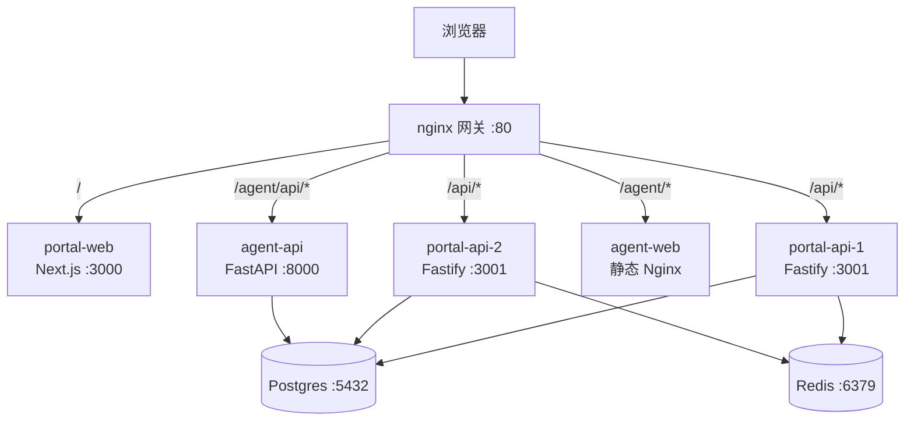

# 技术设计：个人门户 + 自建后端

> 对应需求见 `prd.md`。本文只写技术设计，不重复需求。
>
> **设计原则**：每个技术选型都要能回答「学什么」。凡是为了省事而隐藏原理的选项，一律不选——这直接决定了下面若干处反直觉的选择（裸 `pg` 而非 ORM、手写 OAuth 而非现成库、nginx 网关而非框架内置代理）。

---

## 1. 架构总览

### 1.1 仓库布局（多仓库）

```
xj/
├── MyBlog/          ← 门户仓库（本项目主战场）
│   ├── apps/web     Next.js 门户前端
│   ├── apps/api     Fastify 后端
│   ├── packages/shared   前后端共享类型（R4）
│   ├── gateway/     nginx 配置
│   └── infra/       docker-compose、迁移、脚本
└── my-agent/        ← agent 仓库（独立，不并入）
    ├── backend/     Python + FastAPI
    └── frontend/    Vite + React
```

**为什么是 pnpm workspace 而不是单包**：`packages/shared` 让前后端共享类型定义——API 契约改了，前端编译期就报错，而不是运行时才发现 400。这是 R4 的落地方式，也是本项目最值得学的前端-后端协作实践之一。

**为什么 agent 不并入门户仓库**：它有自己的 git 历史、Trellis、CLAUDE.md 和技术栈。把它并进来会让门户仓库变成多语言大杂烩，且丧失"契约式集成"这一真正该学的模式。

### 1.2 运行时拓扑（本地 Docker Compose）



要点：

- **nginx 是唯一入口**，所有路径路由与负载均衡都在这一层。这是 S5/S7 的学习载体。
- **`portal-api` 起两个实例**，nginx `upstream` 做轮询。这样"无状态设计"不再是口号——你杀掉一个实例，服务不该有感知。
- **两个上游服务技术栈不同**（Node + Python），驱动了契约的中立性。
- **Redis 是所有共享状态的唯一去处**（缓存、限流、refresh token、denylist）。任何放进进程内存的状态都会在多实例下失效——这是与 R9 直接挂钩的核心约束。

### 1.3 nginx 负载均衡方案（含一个真实陷阱）

```nginx
upstream portal_api {
    server portal-api-1:3001;
    server portal-api-2:3001;
    keepalive 32;
}
```

**不用 `docker compose --scale api=3` 的原因**：Compose 的 `--scale` 依赖 Docker 内嵌 DNS 返回多个 A 记录，而 nginx 默认**只在启动时解析一次** `proxy_pass` 里的域名，扩容后新实例收不到流量。要让它工作必须配 `resolver 127.0.0.11` 并把 `proxy_pass` 改成变量形式。这是个经典的时长陷阱，会在 `implement.md` 里作为 S7 的一个必修点单独记录——两条路都实现一遍，对比着学。

显式声明 `portal-api-1/2` 的额外好处：可以随时 `docker compose stop portal-api-1`，直观看到流量自动切到存活实例，这是最直接的容错演示。

---

## 2. 后端设计（`apps/api`）

### 2.1 分层与依赖方向

```
routes      HTTP 边界：解析参数 → 校验 → 调 service → 序列化响应
  ↓         不做业务判断，不写 SQL
service     业务逻辑：纯函数式，只依赖 repository 接口与注入的依赖
  ↓         不知道 HTTP 存在（不碰 req/reply），不知道 SQL 方言
repository  数据访问：SQL 语句 + 行 ↔ 领域对象映射
  ↓         不含业务规则
Postgres
```

**约束**：依赖只能向下。`service` 里出现 `req` 或 `SELECT` 都是设计错误。这条纪律是分层是否真正成立的分水岭，也是 code review 时第一个要查的。

### 2.2 关键选型与理由

| 决策 | 选择 | 理由（学什么） | 被否掉的选项 |
|---|---|---|---|
| 数据库访问 | **裸 `pg` + 手写 SQL** | ORM 恰好隐藏了本项目最想学的东西：执行计划、索引命中、N+1、事务隔离级别、锁 | Prisma / Drizzle 会把这些包起来 |
| 迁移工具 | **`node-pg-migrate`，迁移文件写原生 SQL** | 迁移 = 真实 SQL + 可回滚的 down | 自动生成迁移会跳过"手写 DDL"这一课 |
| 输入校验 | **Zod + `fastify-type-provider-zod`** | 一处定义同时得到运行时校验 + TS 类型，消除 DTO 与类型两份维护 | 纯 JSON Schema 性能更好（Ajv + fast-json-stringify 序列化加速），但类型要手写一遍 |
| JWT | **`@fastify/jwt`** | 密码学部分不自己发明；签发/校验/轮换策略这些"该学的"自己写 | 手写 JWT 签名是浪费，不是学习 |
| OAuth | **手写授权码流**（仅用 HTTP 客户端） | 授权码流、state 防 CSRF、code 换 token、scope 是核心后端知识 | 现成 OAuth 库会跳过全部流程细节 |
| 日志 | **pino** | 结构化日志 + 请求 ID 贯穿，是可观测性的地基 | `console.log` 无法按字段检索 |
| 密码/凭证哈希 | **argon2**（若引入本地账号） | 内存硬哈希 vs bcrypt 的取舍 | 明文或 sha256 是事故 |

### 2.3 鉴权设计（S2 的核心，也是学习密度最高的一块）

**为什么 access token 用 JWT、refresh token 用不透明随机串**——这是本项目最能体现"设计有因"的一处：

| | Access Token | Refresh Token |
|---|---|---|
| 形态 | JWT（自包含） | 随机串（服务端有记录） |
| 有效期 | 15 分钟 | 30 天 |
| 校验方式 | 验签即可，**不查库** | 必须查库/Redis |
| 为何如此 | 无状态才能水平扩容：两个 API 实例都不查库就能验身份 | 必须可吊销：签出去 30 天无法收回的凭证是安全漏洞 |
| 代价 | 签出去就无法主动失效（除非加 denylist） | 每次刷新要查存储，是有状态开销 |

**这正是 R9（负载均衡）倒逼出来的架构决策**：如果 access token 也查库，多实例下每个请求都打到 Postgres，连接池会先撑不住。

**Refresh 轮换 + 复用检测**（生产级做法，必须实现）：

```
客户端持 refresh_1
  → 用它换新 token：签发 refresh_2，把 refresh_1 标记为已用
  → 正常情况：客户端丢弃 refresh_1，此后用 refresh_2
  → 异常情况：refresh_1 再次出现
      ⇒ 说明它被第三方复制过（合法客户端不会再用它）
      ⇒ 撤销该用户整条 token 家族（family），强制重新登录
```

**登出**：撤销 refresh token（DB）+ 把当前 access token 的 `jti` 写入 Redis denylist，TTL = 剩余有效期。这里能直观学到"无状态"与"可吊销"的张力——denylist 本身就是对无状态的一次妥协，且它是**有状态的、必须放 Redis**，又一次指向 R9。

**管理员判定（修复 D1）**：绝不再读 `user_metadata`。改为查数据库 `users.is_admin` 布尔列，或读 JWT 的 `app_metadata`（仅 service_role 可写）。管理员身份由种子迁移或管理命令设置，**不硬编码用户名**（同时消解 Q6 的账号疑点）。

### 2.4 API 契约

- 前缀 `/api/v1`，版本号进路径——为了学"契约演进"，将来`/api/v2` 可与 v1 并存
- 统一错误形态：
  ```json
  { "error": { "code": "ARTICLE_NOT_FOUND", "message": "...", "requestId": "..." } }
  ```
  `code` 供程序判断，`message` 供人读，`requestId` 供对日志——三者职责不混
- 分页统一 `?limit=&cursor=`（游标分页，学 offset 在大表下的性能问题）
- 所有 4xx/5xx 由单一 error handler 产出，路由里不手写响应体

### 2.5 可观测性

- **请求 ID**：读入 `x-request-id`，缺失则生成，贯穿日志与错误响应
- **`/health`**（存活）与 **`/ready`**（就绪，检查 Postgres + Redis 连通）
- 慢查询日志：`pg` 层记录超过阈值的语句及耗时
- 指标：先做最朴素的手写计数器（请求数/错误数/延迟分位），后评估是否引入 Prometheus 客户端

### 2.6 测试策略

| 层 | 工具 | 测什么 |
|---|---|---|
| 单元 | vitest | service 层纯逻辑，repository 用 mock |
| 集成 | vitest + 真实 Fastify app + 测试库 | 路由 → service → repository → 真实 Postgres，含越权用例 |
| 契约 | 共享类型编译期校验（`packages/shared`） | 前后端契约不漂移 |
| e2e | Playwright（S4 之后） | 门户关键路径 |

**越权测试是 R5 的硬性验收**：必须有一组用例覆盖"普通用户尝试增删改文章 / 访问他人资源 / 伪造管理员身份"，且全部返回 403/401。

---

## 3. 前端设计（`apps/web`）

### 3.1 首页定位：门户 hub

**首页是门户，不是文章列表。** 上半部是模块卡片（agent、游戏、GitHub 项目、个人信息），下半部是最新文章摘要。文章列表移到 `/blog`。

理由：项目已明确"不止展示文章，而是若干模块的聚合"。若首页仍是文章流，模块就只是导航栏里几个链接，"门户"这一层就名不副实，S5 的网关工作也失去展示面。

**代价**：博客的"阅读感"被削弱，首屏不再直接是文章。缓解：首页下半部保留最新文章摘要与直达链接，阅读路径依然短。

### 3.2 门户外壳与模块注册表（R13 的落地形态）

门户首页不硬编码链接，而是渲染一份**模块注册表**：

```ts
type PortalModule = {
  id: string
  title: string
  description: string
  icon: string
  path: string                                   // 门户内的挂载路径
  integration: 'reverse-proxy' | 'subdomain'     // 由模块自己声明支持哪种
  embed: 'link' | 'iframe' | 'inline'            // 在门户页面里如何出现，见 §4.2
  health?: string                                // 健康检查地址
  auth: 'public' | 'shared-sso'
  enabled: boolean
}
```

**关键设计**：新增一个模块 = 注册表加一条记录。这让 R13 的"契约"变成可执行的东西，而不是文档里的约定；也是 S9 接入未来两个小站时的唯一接口。

**`embed` 必须由模块声明，不能由门户统一规定**——游戏塞进 iframe 是灾难（键盘焦点捕获、全屏 API 不可用、渲染性能受损），而 agent 这类面板型模块用 iframe 恰好合适。

### 3.3 渲染策略

| 页面 | 策略 | 理由 |
|---|---|---|
| 首页 / 门户 hub | SSR | 模块健康状态实时，不能静态缓存 |
| 模块页面（`/agent` 等） | 按 `embed` 决定 | `link` 型直接整页跳转；`iframe` 型嵌在门户外壳内 |
| 文章列表 / 详情（`/blog/*`） | **SSG + ISR** | SEO 主战场；文章发布后按需 revalidate，兼顾收录与新鲜度 |
| 管理后台 | CSR | 无 SEO 需求，且需登录态 |

**这解决 D7**：文章页产出真实 HTML，社交平台能抓到 OG，爬虫能索引正文。

> 注意：iframe 内的模块内容**对搜索引擎不可见**。因此模块自身仍需可独立直访（反代路径已提供），其 SEO 由模块自己负责，门户不代偿。

### 3.4 数据获取

- 服务端组件直接 `fetch` 门户 API（`/api/v1/*`），携带 `next: { revalidate }` 或 `cache: 'no-store'`
- 浏览器侧需要登录的调用走 `/api/v1/auth/*`
- **类型全部来自 `packages/shared`**——契约漂移在 `tsc` 阶段就被拦住

### 3.5 设计令牌层（统一视觉，不统一组件库）

**结论：统一设计令牌，不统一组件库。**

实测两个已有模块的技术栈：

| | 门户（MyBlog） | agent（my-agent） |
|---|---|---|
| 构建 | Vite 4 | Vite 5 |
| UI 组件 | Tailwind 3 + 自建组件 | **antd 6.6.4 + @ant-design/x** |
| 设计令牌 | CSS 变量（HSL） | **CSS 变量（hex）——已存在** |
| 状态 | zustand 5 | zustand 5 |
| 测试 | 无 | vitest + Testing Library |

**为什么不该统一组件库**：三种模块是三种不同的 UI 问题——博客是内容阅读（排版、代码高亮），agent 是 AI 对话工作台（表格、树、表单、对话气泡），游戏是 canvas。用 Tailwind 手搓 antd 的表格/树要数天；用 antd 做博客排版又重又难看。

**为什么统一令牌却可行且便宜**：两边**都已经有 CSS 变量令牌层**——`apps/web/src/index.css` 用 HSL 变量，agent `src/styles.css` 用 hex 变量，且浅色底都是暖白系（`#F6EFE9` vs `#fafaf9`），方向本来就一致。统一只需定一份规范值，两边各自映射，谁都不用换组件库。

**形式必须是技术栈无关的**：

- 令牌以 **CSS 变量 + tokens JSON** 发布
- **不能是 React 组件包**——游戏是 canvas，Python 服务端渲染的模块也不消费 React 包，但都读得懂 CSS 变量与 JSON

这与 §4.1「接入契约不约束模块用什么语言」是同一条原则：**共享的东西必须与技术栈无关**。

**分层职责**：

| 层 | 是否统一 | 形式 |
|---|---|---|
| 设计令牌 | ✅ 统一 | CSS 变量 + tokens JSON |
| 组件库 | ❌ 各自选择 | — |
| 导航外壳 | ⚠️ 各模块自实现，视觉对齐令牌 | 不共享组件，只共享变量 |

---

## 4. 模块接入契约（R13 / R14 / R15）

### 4.1 契约内容

模块必须提供：

| 项 | 形式 | 说明 |
|---|---|---|
| 元数据 | 注册表条目 | 标题、图标、路径、描述 |
| 接入模式 | `reverse-proxy` 或 `subdomain` | 模块自声明；反代需支持子路径部署 |
| 嵌入模式 | `link` / `iframe` / `inline` | 模块自声明，见 §4.2 |
| 健康检查 | `GET <path>/health` | 200 = 健康 |
| 鉴权约定 | `shared-sso` 或 `public` | 见 §4.4 |

门户必须提供：

- 统一的导航外壳（模块切换、登录态、主题）
- 模块不可用时的降级 UI（而非整页报错）
- 登录态向模块传递的机制

### 4.2 三种嵌入模式（双入口的核心）

**前提**：反代路径天然满足"模块不只能从门户进入"——`/agent/` 既是门户页面里的嵌入地址，也是可以直接贴给别人的独立地址。**同一个 URL 服务两种入口，不需要做两套集成。**

| 模式 | 行为 | 适用 | 本项目例子 |
|---|---|---|---|
| `link` | 门户首页显示卡片，点击整页跳转到模块路径 | 全屏型、沉浸型 | 游戏（iframe 会毁掉键盘焦点、全屏 API 与渲染性能） |
| `iframe` | 门户页面内嵌一个指向同源模块路径的 iframe | 面板型，能与文章等其他内容并存 | agent（文章旁开对话面板） |
| `inline` | 直接以组件形式渲染 | 同构模块（同为 React 且愿意共享运行时） | 未来用 React 写的小站 |

**为什么 `inline` 在本项目基本不会被用到**：它要求两个应用共享同一次 React 运行时，而这会撞上 §8 记录的 antd CSS-in-JS 与 Tailwind preflight 互相污染的问题。保留这个枚举值是为了契约完整性（未来若写一个纯 Tailwind 的小站，可以走这条）。

**同源 iframe 的一个被低估的好处**：**cookie 天然共享**。门户与模块同域，`HttpOnly` cookie 直接可用，SSO 不需要 `Domain=.example.com`，也不需要 CORS 白名单。子域"逃生舱"模式反而要把这套全做一遍——这正是它的代价所在。

**iframe 必须注意的三件事**：

1. 模块响应需允许被嵌入：不设 `X-Frame-Options: DENY`，或在 CSP 中显式声明 `frame-ancestors` 为门户源
2. 高度自适应需要 `postMessage` 通信（iframe 无法被子文档撑高）
3. iframe 内的内容对搜索引擎不可见——模块的 SEO 由其独立地址自行负责，门户不代偿

### 4.3 子路径部署的改造清单（每个模块的主要工作量）

这是接入时最容易踩、也最值得记录的部分——**配错的后果是白屏或资源 404，不是配置报错**：

| 模块 | 需要改什么 |
|---|---|
| portal-web（Next.js） | `basePath`（若门户自身也在子路径下）、`assetPrefix` |
| agent-frontend（Vite） | `base: '/agent/'`；前端路由 router 需设 basename |
| agent-backend（FastAPI） | `root_path='/agent/api'`；uvicorn 加 `--proxy-headers`；否则重定向与 OpenAPI 文档里的 URL 全错 |
| 所有模块 | 前端发请求的 base URL 需可配置，不能硬编码 `/api` |

### 4.4 统一鉴权（R15）

- **推荐：cookie 域下共享**。门户与模块在同一域名（反代模式）下，refresh token 放 `HttpOnly` + `SameSite=Lax` cookie，`path=/`。模块校验同一份 JWT。
- **同源 iframe 直接受益**：SameSite=Lax 允许同站 iframe 携带 cookie，因此 `embed: 'iframe'` 的模块在门户页面内**自动处于已登录态**，无需任何额外机制。这是选择同源反代而非子域的一个实质收益。
- **子域模式**：cookie 需 `Domain=.example.com`（跨子域共享）；跨域 fetch 需 `credentials: 'include'` + CORS 白名单；iframe 还需处理跨站 cookie（SameSite=None + Secure，且浏览器可能拦截第三方 cookie）。这一套比反代模式复杂得多，**正是"逃生舱"的代价**。
- 各模块授权边界独立：门户只负责"你是谁"，"你能做什么"由各模块自己判。

### 4.5 容错（R14）

- 门户定时（或按需）探活各模块 `health`，结果缓存进 Redis（短 TTL）
- 模块 down → 门户卡片显示"维护中"，入口置灰，**不阻塞其他模块**
- nginx 侧配 `proxy_next_upstream` 与超时，避免慢模块拖垮网关

---

## 5. 数据设计

### 5.1 从 Supabase 迁移到自建 Postgres

**迁移是单向的、可回退的**：

1. Supabase 侧导出：`pg_dump --data-only`（拿连接串）或控制台 CSV。
2. 自建侧 schema 用**手写 SQL 迁移**重建（不是复制 Supabase 的 DDL）——借这次机会把 D8/D9/D10 一并修掉。
3. 导入数据 + 校验行数/抽样比对。
4. 前端读路径切到自建 API 后，**Supabase 保持只读**一段时间作为对照，确认无误再停用。

### 5.2 Schema 变更（相对现状）

```sql
-- 新增：草稿与定时发布（D9）
alter table articles add column status text not null default 'published'
  check (status in ('draft','published','archived'));
alter table articles add column published_at timestamptz;
alter table articles add column views int not null default 0;

-- 新增：评论嵌套（D8）
alter table comments add column parent_id uuid references comments(id) on delete cascade;

-- 修复：评论改用外键关联（D10），避免改 slug 即孤儿
alter table comments add column article_id uuid references articles(id) on delete cascade;

-- 新增：管理员标识（修复 D1 —— 不再依赖可被用户篡改的 user_metadata）
alter table users add column is_admin boolean not null default false;

-- 索引：为分页与标签查询准备
create index on articles (status, published_at desc);
create index on articles using gin (tags);
create index on comments (article_id, created_at);
```

> `tags` 保留 `text[]` + GIN 索引，**不**改关联表——博客量级下关联表是纯粹的多余复杂度（PRD 已列为不在范围）。

---

## 6. 关键权衡记录

| 权衡 | 选择 | 代价 | 何时该反悔 |
|---|---|---|---|
| 裸 SQL vs ORM | 裸 SQL | 手写映射代码更多、易写错列名 | 如果发现自己在重复写同一套 CRUD 映射 3 次以上 |
| 手写 OAuth vs 库 | 手写 | 安全细节要自己负责（state、PKCE、重放） | 如果目标是交付速度而非学习 |
| 路径反代 vs 子域 | 反代为主 | 每个模块都要改子路径配置，易白屏 | 若某模块改造成本超过其价值 → 用逃生舱走子域 |
| access JWT 无状态 | 是 | 无法主动失效，需 denylist 补 | 若安全要求提高 → 改短 TTL + 强制 denylist 校验 |
| 游标分页 vs offset | 游标 | 无法跳页 | 若后台需要"跳到第 N 页" → 后台单独用 offset |
| 显式 api-1/api-2 vs `--scale` | 显式 | 扩容不灵活 | 若实例数常变 → 改 Docker DNS + resolver 方案 |
| 统一令牌 vs 统一组件库 | 只统一令牌 | 各模块 UI 观感靠自觉对齐，无强制 | 若某模块明显跑偏 → 把令牌做成 lint 规则或构建期校验 |
| 路径反代 + 同源 iframe vs 子域 | 反代 + 同源 | iframe 无法共享 DOM/状态，高度需 `postMessage` | 若某模块强烈需要与门户共享状态 → 评估 `inline` 或子域 |
| 首页做门户 hub vs 保持文章流 | 门户 hub | 首屏不再是文章，博客"阅读感"被削弱 | 若发现访客绝大多数只看文章 → 把博客提回首页主位 |

---

## 7. 风险与回滚

| 风险 | 影响 | 应对 |
|---|---|---|
| 数据迁移丢失/错乱 | 文章丢失 | 迁移前全量备份；导入后行数与抽样校验；Supabase 保持只读对照 |
| 手写鉴权出安全漏洞 | 真实越权 | 越权测试集为硬性验收；上线前专门过一遍 OWASP 会话管理清单 |
| 子路径配置踩坑 | 模块白屏 | 每个模块接入即为独立可交付版本，失败可单独回退 |
| 范围失控（10 个阶段） | 长期不完工 | 每阶段结束都是可访问版本；阶段边界即停靠点 |
| 缓存引入不一致 | 用户看到旧数据 | 先不加缓存，用压测数据证明需要再加；失效策略与写路径同步设计 |
| 多实例状态泄漏 | 随机 401/权限错乱 | 共享状态只允许放 Redis；单元测试禁止模块级可变全局量 |

**回滚锚点**：每个阶段结束打一个 git tag；数据库每次迁移都写 `down`；`docker compose` 的镜像按阶段打 tag，回滚 = 换 tag + 跑 down 迁移。

---

## 8. 本设计刻意不做的事

- **不引入 K8s**：本地 Compose 已足够覆盖负载均衡、健康检查、服务发现的学习目标；K8s 的复杂度会淹没重点
- **不上微前端**（Module Federation）。技术上并非不可能——门户与 agent 同为 React 18 + Vite + zustand。但有三个具体理由否掉它：
  1. **全局样式会互相污染**。agent 用 antd 6（CSS-in-JS），门户用 Tailwind 3（工具类 CSS + preflight）。塞进同一个 document 后，antd 的 `body`/`*` 重置会污染门户，门户的 preflight 会破坏 antd 组件。这是具体冲突，不是风格偏好。
  2. **异构模块根本无法参与**。游戏是 canvas、agent 后端是 Python，未来的小站技术栈未知。为三分之一的模块引入一套要求同构的架构，收益覆盖不了成本。
  3. **它会耦合各模块的发布周期**——而契约式集成存在的意义恰恰是解耦这一层。
  
  微前端的真正收益在"多团队独立发布"，本项目是单人开发，无此问题。
- **不用 ORM**：见 §2.2
- **不引入消息队列中间件**（Kafka/RabbitMQ）：后台任务先用 Redis 承载（BullMQ），最后一个阶段再评估是否值得换
