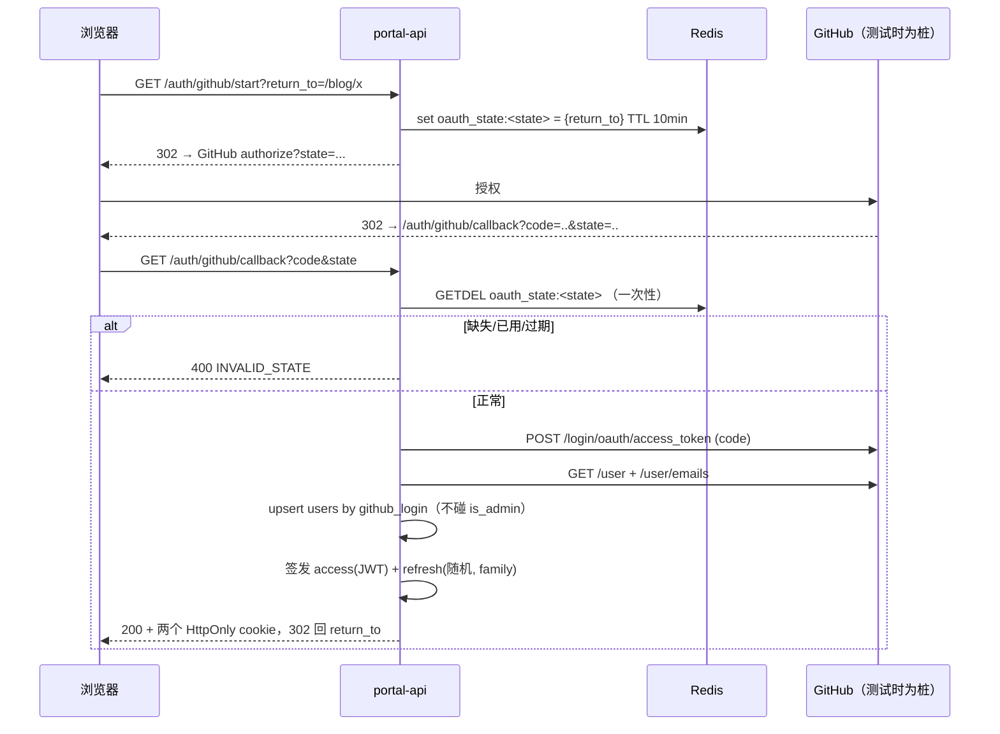

# S2 技术设计

> 需求见 `prd.md`；全局鉴权设计见父任务 `design.md` §2.3。本文只补 S2 落地所需的契约与取舍。

---

## 1. 令牌模型：为什么两种令牌长得不一样

这是本阶段最能体现"设计有因"的一处。**不是随便选了 JWT + 随机串**，是 R9（多实例水平扩容）与可吊销性之间的必然折中：

| | Access token | Refresh token |
|---|---|---|
| 形态 | JWT（自包含） | 高熵随机串（256 bit） |
| 有效期 | **15 分钟** | **30 天** |
| 校验 | 验签 + **查 denylist** | **查库**（存哈希） |
| 为何如此 | 无状态：任一举例都能验，不必每个请求打 Postgres | 30 天不可吊销的凭证是安全漏洞，必须可撤销 |
| 存哪 | 不存 | 只存 **SHA-256 哈希** |
| 泄漏后果 | 最多 15 分钟（且可入 denylist 立即失效） | 可换取新令牌，故必须哈希存储 + 轮换 + 复用检测 |

**推论：denylist 是无状态设计的对价，而它本身是有状态的 ⇒ 必须放 Redis。** 多实例下内存里的 Set 会让"哪个实例收到登出"决定登出是否生效——这正是 R9 要防的。

**access 载荷只放 `sub` + `jti`，不放角色。** 权限一律查库（见 §5）。理由：JWT 里的权限在被签发后无法收回，而 `is_admin` 恰恰是最需要即时生效的位。管理员接口调用频率极低，一次 DB 读换来即时撤销是合算交易；普通请求仍只验签。

### 复用检测算法（必须实现并有测试）

```
presented = sha256(cookie)
row = select ... where token_hash = presented

若 row 不存在                → 401（未知/已随家族撤销）
若 row.revoked_at 非空        → 复用！撤销该 family 全部 token → 401
若 row.expires_at < now()    → 401
否则：
  新 token = random()
  事务内：insert 新行（同 family_id）; update 旧行 set revoked_at = now()
  → 旧 token 从此只能用一次
```

**为什么"已用过的再出现"就等于被复制**：合法客户端拿到新 token 后会丢弃旧的（我们也在响应里告知新值），所以旧 token 被再次出示，只能说明有人另存了一份。此时撤销整条家族是对两者都安全的选择。

---

## 2. 表结构（迁移 `0002`）

```sql
-- S1 建的 users.id 没有默认值；当时由外部提供 id，现在本服务自建用户，需要默认值。
alter table users alter column id set default gen_random_uuid();

create table refresh_tokens (
  id          uuid primary key default gen_random_uuid(),
  user_id     uuid not null references users(id) on delete cascade,
  token_hash  text not null unique,            -- SHA-256 hex，绝不存明文
  family_id   uuid not null,                   -- 同一条链共享，供复用检测整族撤销
  issued_at   timestamptz not null default now(),
  expires_at  timestamptz not null,
  revoked_at  timestamptz,                     -- 非空 = 已被轮换或撤销
  client_hint text                             -- user agent 摘要，仅供排查，不作判定依据
);

create index refresh_tokens_user    on refresh_tokens (user_id);
create index refresh_tokens_family  on refresh_tokens (family_id);
create index refresh_tokens_expiry  on refresh_tokens (expires_at) where revoked_at is null;
```

**down**：`drop table refresh_tokens;` + 恢复 `id` 无默认值。

`client_hint` 不参与任何授权判断——把它当判定依据会造成"换了 UA 就踢人"之类的误伤。它只为人工排查留线索。

---

## 3. 登录时序



`return_to` **必须只允许站内相对路径**：`/^\/(?!\/)/` 且无 `\`。直接拼接成 `Location` 会做出一个**开放重定向**——攻击者用你的合法域名引导用户跳到外站，这是钓鱼链上白送的一环。

---

## 4. 端点契约

```
GET  /api/v1/auth/github/start     ?return_to=/blog/x        → 302
GET  /api/v1/auth/github/callback  ?code&state                → 302 + Set-Cookie ×2
POST /api/v1/auth/refresh                                     → 200 + Set-Cookie ×2 | 401
POST /api/v1/auth/logout                                      → 204
GET  /api/v1/auth/me                                          → 200 {user} | 401

（无管理接口：`is_admin` 只由数据库列与 CLI 改变。`requireAdmin` 仍需实现，
 供 S3 的管理写接口使用，本阶段以测试内临时路由单测该中间件。）
```

### 成功响应 `GET /auth/me`

```json
{ "user": { "id": "uuid", "login": "guoshaoran",
            "displayName": "…", "avatarUrl": "…", "isAdmin": true } }
```

`isAdmin` 来自**当场查库**，不来自令牌。

### 校验与错误矩阵

| 条件 | 状态 | `code` |
|---|---|---|
| `state` 缺失/未知/已用过 | 400 | `INVALID_STATE` |
| 回调带 `error=` | 400 | `OAUTH_DENIED` |
| code 交换失败 / 非 2xx | 502 | `OAUTH_EXCHANGE_FAILED` |
| 用户信息拉取失败 | 502 | `OAUTH_PROFILE_FAILED` |
| `return_to` 非站内相对路径 | 400 | `BAD_REQUEST` |
| 无/无效/过期 access token | 401 | `UNAUTHORIZED` |
| access 在 denylist 中 | 401 | `TOKEN_REVOKED` |
| refresh 缺失/未知/过期 | 401 | `UNAUTHORIZED` |
| **refresh 已被轮换（复用）** | 401 | `TOKEN_REUSE_DETECTED`（并撤销整族） |
| 有身份但非管理员访问需管理员的接口 | 403 | `FORBIDDEN` |

### Cookie 属性

| | `portal_access` | `portal_refresh` |
|---|---|---|
| HttpOnly | ✅ | ✅ |
| SameSite | `Lax` | `Strict` |
| Path | `/` | `/api/v1/auth` |
| Secure | 非 dev 环境强制 | 同 |
| Max-Age | 900 | 30 天 |

**`HttpOnly` 挡的是 XSS 偷令牌；`SameSite` 挡的是跨站表单带 cookie。两者各挡一半，不是二选一。** refresh 的 `Path` 收窄意味着只有鉴权路由会收到它，减少暴露面。

`credentials: true` 打开后，CORS 的 origin **必须**是显式单值——`*` 加 credentials 会同时被浏览器拒绝并让所有站点都能带 cookie 发请求。

---

## 5. 授权：`is_admin` 的唯一真相

```
requireAuth   : 验签 → 查 denylist → 载入 req.auth = { sub, jti }
requireAdmin  : requireAuth 之后 → select is_admin from users where id = $1
                非真 → 403；用户行不存在 → 401（身份有效但已无账户）
```

**只读数据库列，永不读令牌声明、永不读 `user_metadata`。** 这一条同时解决 D1 并解决"D1 的界面判断与后端不一致"：前端 `useAuthStore.isAdmin` 改为来自 `/auth/me` 的 `isAdmin` 字段。

**引导**：seed 在 dev 把 `github_login='guoshaoran'` 的行置 `is_admin=true`；生产由 `pnpm --filter api admin grant <login>`（要求用户已存在于表中，且必须在服务端执行）。

**不提供 HTTP 管理接口**（已裁剪）。这带来一个诚实的后果：`requireAdmin` 在本阶段没有产品级靶子，因此 403 只能以中间件单测覆盖，端到端授权测试要等 S3。

---

## 6. 桩 IdP（测试专用）

`src/test/fake-oauth.ts`：一个真实的 Fastify 小服务，监听临时端口，实现三个端点：

```
GET  /authorize        302 回 callback，附带 code（可控：可省略 state、可带 error=）
POST /login/oauth/access_token   可控：200 {access_token} / 401 / 非 JSON / 延迟
GET  /user             可控返回 login/avatar
GET  /user/emails      可控返回邮箱
```

provider 基址从配置读（`OAUTH_BASE_URL`），因此**生产指向 github.com，测试指向桩，是同一条代码路径**。

覆盖真 provider 给不出的分支：`state` 不匹配、code 被用两次、`error=access_denied`、
交换返回 401、交换返回 200 但缺字段、profile 超时。

---

## 7. CSRF 与"cookie 会话"的诚实说明

写接口要求自定义头 `x-requested-with: portal`（跨站表单无法设置自定义头，浏览器会拦）。
`SameSite` 已挡掉大部分场景，但 **顶级导航的 GET 在 Lax 下仍会带 cookie**——所以
`start`/`callback` 这类 GET 不做状态破坏（callback 只创建会话，不销毁），而
`logout`/`refresh` 用 POST + 自定义头。

**这是"两层各挡一半"的教科书写法**，注释里写清楚，别让后来者以为 SameSite 够用了。

---

## 8. 权衡记录

| 权衡 | 选择 | 代价 | 何时反悔 |
|---|---|---|---|
| HS256 单密钥 vs 非对称 | HS256 | 无法把"验签"安全下放给非 Node 模块 | **S5 若某模块要在自己后端离线验 JWT → 换 EdDSA + 暴露 JWKS**（本阶段不预建） |
| JWT 里放角色 vs 查库 | 查库 | 管理员接口每次一个 DB 读 | 若该读成为瓶颈 → 短 TTL 缓存并挂吊销信号 |
| HttpOnly cookie vs localStorage | cookie | 需 CSRF 防护、需 `credentials` | 不反悔：localStorage 里的令牌一旦出现 XSS 就被整份读走 |
| 复用即撤全族 vs 只撤单个 | 撤全族 | 用户可能在多设备被连带踢出 | 不反悔，这是标准做法 |
| 桩 IdP vs 真 GitHub 测试 | 桩 | 真 provider 的怪癖（如 scope 大小写）测不到 | 交付清单里要求一次真实登录走查 |

---

## 9. 风险

| 风险 | 应对 |
|---|---|
| 手写鉴权出真漏洞 | 越权测试集为硬性验收；实现完专门过 OWASP 会话管理清单并记录结论 |
| 密钥泄漏到前端产物 | 只允许非 `VITE_`/`NEXT_PUBLIC_` 前缀；CI 增加一条产物扫描断言 |
| 两套身份体系并存期混乱 | 明确记录：S3 之前写路径仍走 Supabase，不宣称"已脱离" |
| 开放重定向 | `return_to` 白名单化 + 专门测试用例 |
| refresh 明文进日志 | `client_hint` 与日志字段只记哈希前缀；加断言 |
